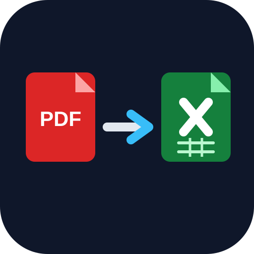

<!-- Improved compatibility of back to top link: See: https://github.com/othneildrew/Best-README-Template/pull/73 -->
<a name="readme-top"></a>
<!--
*** Thanks for checking out the Best-README-Template. If you have a suggestion
*** that would make this better, please fork the repo and create a pull request
*** or simply open an issue with the tag "enhancement".
*** Don't forget to give the project a star!
*** Thanks again! Now go create something AMAZING! :D
-->


<!-- PROJECT SHIELDS -->
<!--
*** I'm using markdown "reference style" links for readability.
*** Reference links are enclosed in brackets [ ] instead of parentheses ( ).
*** See the bottom of this document for the declaration of the reference variables
*** for contributors-url, forks-url, etc. This is an optional, concise syntax you may use.
*** https://www.markdownguide.org/basic-syntax/#reference-style-links
-->
[![Contributors][contributors-shield]][contributors-url]
[![Forks][forks-shield]][forks-url]
[![Stargazers][stars-shield]][stars-url]
[![Issues][issues-shield]][issues-url]
[![MIT License][license-shield]][license-url]


<!-- PROJECT LOGO -->
<br />
<div align="center">
  <a href="https://github.com/andrefdre/EplanInOut2xlsx">
    
  </a>

<h3 align="center">EplanInOut2xlsx</h3>

  <p align="center">
    Consists of a script that extracts the inputs and outputs information of a PDF that was generated using Eplan and saves it in an Excel file. This is useful for people who want later use the excel to import the data to TIA Portal.
    <br />
    <a href="https://github.com/andrefdre/EplanInOut2xlsx/wiki"><strong>Explore the Wiki »</strong></a>
    <br />
    <br />
    <a href="https://github.com/andrefdre/EplanInOut2xlsx/issues">Report Bug</a>
    ·
    <a href="https://github.com/andrefdre/EplanInOut2xlsx/issues">Request Feature</a>
  </p>
</div>


<!-- TABLE OF CONTENTS -->
<details>
  <summary>Table of Contents</summary>
  <ol>
    <li>
      <a href="#about-the-project">About The Project</a>
    </li>
    <li>
      <a href="#getting-started">Getting Started</a>
      <ul>
        <li><a href="#installation">Installation</a></li>
      </ul>
    </li>
    <li><a href="#usage">Usage</a></li>
    <li><a href="#contributing">Contributing</a></li>
    <li><a href="#license">License</a></li>
    <li><a href="#contact">Contact</a></li>
  </ol>
</details>


<!-- ABOUT THE PROJECT -->
## About The Project
<div align="center">

</div>

This project was developed for Advanced Industrial Vision Systems class for the second report. The objective is to detect and extract objects from a point cloud and then pass it through a classifier that will tell what the object is and some information about it's physical characteristics. For example, it's a Mug and has a certain bounding box.  

<p align="right">(<a href="#readme-top">back to top</a>)</p>


<!-- ### Built With

* [![Next][Next.js]][Next-url]
* [![React][React.js]][React-url]
* [![Vue][Vue.js]][Vue-url]
* [![Angular][Angular.io]][Angular-url]
* [![Svelte][Svelte.dev]][Svelte-url]
* [![Laravel][Laravel.com]][Laravel-url]
* [![Bootstrap][Bootstrap.com]][Bootstrap-url]
* [![JQuery][JQuery.com]][JQuery-url]

<p align="right">(<a href="#readme-top">back to top</a>)</p> -->


<!-- GETTING STARTED -->
## Getting Started

This project is still in development, but you can find the installation instructions and usage examples below. If you have any questions, please open an issue or contact me directly.


### Installation
To install the project, clone the repository, running the following lines:
```
git clone https://github.com/andrefdre/EplanInOut2xlsx.git
cd ./EplanInOut2xlsx
```

To install all the dependencies of this package, just run in your terminal:
```
pip install -r requirements.txt
```

If you have/want to use a Kinect camera with this project, you can find [here](https://github.com/andrefdre/Dora_the_mug_finder_SAVI/wiki/Instalation#kinect) how to install all the dependencies needed.

<p align="right">(<a href="#readme-top">back to top</a>)</p>

<!-- USAGE EXAMPLES -->
## Usage

### Running the script
To Run the code:
```
./ExtractInOutPDF.py
```

<!-- CONTRIBUTING -->
## Contributing

If you have a suggestion that would make this better, please fork the repo and create a pull request. You can also simply open an issue with the tag "enhancement".
Don't forget to give the project a star! Thanks again!

1. Fork the Project
2. Create your Feature Branch (`git checkout -b feature/AmazingFeature`)
3. Commit your Changes (`git commit -m 'Add some AmazingFeature'`)
4. Push to the Branch (`git push origin feature/AmazingFeature`)
5. Open a Pull Request

<p align="right">(<a href="#readme-top">back to top</a>)</p>


<!-- LICENSE -->
## License

Distributed under the GPL License. See `LICENSE.txt` for more information.

<p align="right">(<a href="#readme-top">back to top</a>)</p>


<!-- CONTACT -->
## Contact

André Cardoso - andrefdre@gmail.com

Project Link: [ExtranInOutPDF](https://github.com/andrefdre/EplanInOut2xlsx)

<p align="right">(<a href="#readme-top">back to top</a>)</p>


<!-- MARKDOWN LINKS & IMAGES -->
<!-- https://www.markdownguide.org/basic-syntax/#reference-style-links -->
[contributors-shield]: https://img.shields.io/github/contributors/andrefdre/EplanInOut2xlsx.svg?style=for-the-badge
[contributors-url]: https://github.com/andrefdre/EplanInOut2xlsx/graphs/contributors
[forks-shield]: https://img.shields.io/github/forks/andrefdre/EplanInOut2xlsx.svg?style=for-the-badge
[forks-url]: https://github.com/andrefdre/EplanInOut2xlsx/network/members
[stars-shield]: https://img.shields.io/github/stars/andrefdre/EplanInOut2xlsx.svg?style=for-the-badge
[stars-url]: https://github.com/andrefdre/EplanInOut2xlsx/stargazers
[issues-shield]: https://img.shields.io/github/issues/andrefdre/EplanInOut2xlsx.svg?style=for-the-badge
[issues-url]: https://github.com/andrefdre/EplanInOut2xlsx/issues
[license-shield]: https://img.shields.io/github/license/andrefdre/EplanInOut2xlsx.svg?style=for-the-badge
[license-url]: https://github.com/andrefdre/EplanInOut2xlsx/blob/master/LICENSE.txt
[product-screenshot]: Docs/logo.svg
